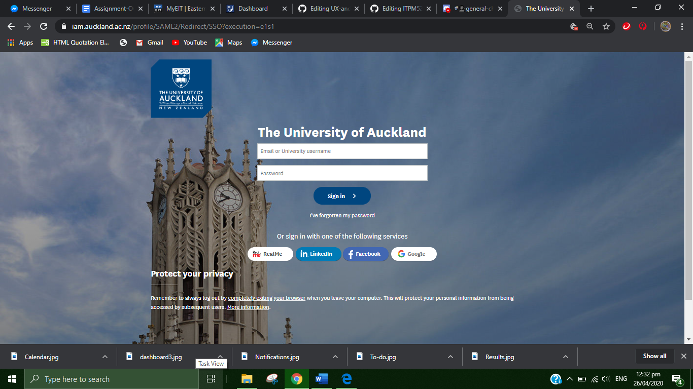

# UX-and-UI-Assignment

Website and App design

## Team Nihhhhhh

### Team Proposal         

Team will Develop/Revamp the EIT App and Website with additional features (to the current design) that will bring a more pleasant UX interaction to students that are currently enrolled at EIT. The new design will consist of students from all campuses based around New Zealand with a more vast and simplistic approach to the current EIT App and Website improving the layout design and enhancing the current features with additional features for the EIT App and Website for students. 

### List of improvements and additional features (Website/App)

1. **Login/ Register**

- Register (First Name, Last Name, Phone Number etc.)
- Login (Login with User Name, Email or Phone Number then enter Password)  

2. **Campus Select feature where any student enrolled with EIT from around the country can Login and have features (Once Logged in) such as:**

- Campus Select (select what campus you're attending e.g Auckland, Taradale Gisborne etc.)

3. **Once inside your selected Campus**

- Select Subject and level (select subject you are going to take e.g Computers, Nursing, Fashion etc. then the level of that subject e.g Level 1, Bachelors, Diploma etc.)

**Note: The above process is only for first timers logging in or registering**

4. **Home Page- once you’ve completed the above it will take you to the Home Page. Home Page features would include:**

- My Courses (will show you the course information, the course you are doing, the subjects you are taking in that course and the tutors running the course)
- My Timetable (Timetable showing your class times, due dates, location of classes and lecturer)
- My Grades (Previous course grades done in the past and current course grades)
- My Campus Map (Campus map that will show you where your classes are located)
- My Campus Events (Campus Events displaying upcoming course events, event dates and event times.
- My Calendar (adding Campus events, assessment due dates, course goals, and notes.)

### Functional vs Non-Functional 

Before we begin with exemplars about functional and non-functional requirements, we must understand the concept of those terms.  

Functional - In simple words, It describes what the system should do.

Non-Functional - Where Functional requirements explain what the system should do, Non-Functional requirements describe how the system should operate. 

For example, a music speaker should play sound. How? Through sound waves of n length and decibels of x frequency, allowing us to fluctuate low or high frequency of sound.

Relating this to the EIT website and App, we will have two Functional requirements for Website and App, respectively. Summing up of four functional requirements.

### Functional

1. **Login (App)** - The App Login menu must be able to Register or Login via Username, Email or Phone number and Password. This will be connected to the EIT login database.

2. **My Timetable (App)** - Timetable showing your class times, due dates, location of classes and lecturer on campus.

3. **Campus Map (App)** -  Campus map will provide details of class location and if you have classes present that day, classes will be active with colour code.

4. **Overall Grade System (App)** - OGS will show grades from all programs and courses and will also show your current percentage of the year.

5. **My Campus Map (Website)** - Campus map that will show the user (student) where your classes are located. 

6. **My Courses (Website)** - will show you the course information, the course you are doing, the subjects you are taking in that course and the tutors running the course. (Revamp!)

7. **My timetable (Website)** -  My timetable will show classes, times and locations on campus.

8. **My Grade System (Website)** - MGS will show grades overall with one click.

### Non-Functional

1. **Login (App)** - This non-functional requirement will provide user interaction via text input boxes for username/email and password. Login/Register displays success or an error message within 3 seconds or less of confirmation. This will synchronize with the MyEIT website so when Login credentials and other necessities are updated, the app will be updated.

2. **My Timetable (App)** - Timetable will synchronize with MyEIT website everys 10 minute refresh rate.

3. **Campus Map (App)** - Campus Map will synchronize with MyEIT database and refresh every 10 seconds or done so by the user and will update the map in real-time.

4. **Overall Grade System (App)** - OGS will show current grades from real-time and synchronize with MyEIT server.

5. **My Campus Map (Website)** - Campus map will show the user (student) where your classes are with a refresh rate of 60 seconds.

6. **My Courses (Website)** - My Courses will have a Loading rate of 10 seconds after interaction

7. **My Timetable (Website)** - The user will interact with the timetable button and this will display the timetable of the current user (Student) within a few seconds.

8. **My Grade System (Website)** - MGS will syncrhonize with the EIT database and provide current grades to students. This will then provide DATA to the EIT App when in synchronization mode. 

## Evaluation

### Website Example

#### Auckland Uni Login - Displays user input credentials

#### Auckland Uni Dashboard - Shows current classes, due dates and able to see class grades through one click.

#### Auckland Uni Calendar - Shows timetable, classes, class time, due dates, campus events, location.

### App Example

#### Auckland Uni Calander - Displays the users calender related social events

#### Auckland Uni Files - Deisplays the users current files on the online database

